<a href="https://proof-navy.vercel.app">
  
</a>



I build the layers between a model and a person — transactional backends, on-device
perception, cross-language static analysis. The architecture gets written down before the
code, and every figure below links to the thing it was counted from.

**[Portfolio](https://proof-navy.vercel.app)** · **[Résumé](https://proof-navy.vercel.app/resume.pdf)** · **[LinkedIn](https://linkedin.com/in/saha-ronit)** · **[Email](mailto:ronitsaha.edu@gmail.com)**

B.Tech Computer Science, Lovely Professional University · Jalandhar, India · open to
internship and new-grad software engineering roles.

---

## Systems

Ownership is stated because on half of these it is partial. A commit ratio is not modesty;
it is the difference between a claim you can check and one you cannot.

| System | What it does | Mine | Stack |
|---|---|---|---|
| **[Ground Truth](https://github.com/ronitsaha11/portfolio)** · [live](https://proof-navy.vercel.app) | This portfolio. One WebGL scene behind a scroll-driven narrative, six case studies paced as pinned journeys, and a build gate that fails if a figure ships without a source. | Sole author | Next.js 15 · React 19 · three.js · anime.js |
| **[PratiBimb](https://github.com/ronitsaha11/pratibimb)** | A browser agent that sees your screen without your screen reaching the server. Sensitive spans leave as typed placeholders; the client substitutes the real value at the instant of execution. | **168 / 274 commits**, 25 merged PRs. Two-person team — I own the repository, the governance layer and review. | TypeScript · Chrome MV3 · ONNX Runtime Web · FastAPI |
| **[Cartograph](https://github.com/Rexy-5097/cartograph)** | Follow a TypeScript call across an HTTP boundary into a Python route, through an ORM model, to the database table it writes — with the evidence attached to every hop. | **57 / 217 commits**, 41 / 58 merged PRs. Contributor; the project is led by Soumyadeb Tripathy. Mine is the analysis engine, milestones M11–M16. | Rust · tree-sitter · petgraph · Tauri v2 |
| **[TerraMind AI](https://github.com/ronitsaha11/TerramindAI)** | Satellite scenes in, segmented geometry and spectral statistics out, with a job platform underneath so nothing blocks a request. | **Sole author**, 116 commits, no co-authors. | Python · FastAPI · PostGIS · Celery · PyTorch · deck.gl |
| **[Stealth F.R.I.D.A.Y](https://github.com/ronitsaha11/Stealth-FRIDAY)** | A voice agent that runs entirely on your own machine, with a dashboard streaming its state over WebSocket. | The dashboard, the control API and the automation tools. **The agent core is a shared codebase, not mine.** | Python · Next.js · Faster-Whisper · WebSocket |
| **[HealthTrack](https://github.com/ronitsaha11/HealthTrack)** | A reminder that fires late is a reminder that failed. Built so scheduling survives reboots, timezone shifts and clock changes. | **Sole author**, 174 files. | Kotlin · Jetpack Compose · Room · WorkManager |
| **[EcoShare](https://github.com/Somnath29/EcoShare)** | Surplus food redistribution between kitchens, students and NGOs. The only one of these that is deployed and publicly reachable. | **8 / 50 commits.** Four-person build — the listing endpoints, the Food model, the validators, the dashboard integration and the deploy config. | TypeScript · Express · MongoDB · React |

Each of these has a full case study on the [portfolio](https://proof-navy.vercel.app), with its
architecture, the hard part, the options that were rejected, and what is still wrong with it.

<details>
<summary><b>What is <i>not</i> finished</b></summary>

<br/>

Worth saying out loud, because a list of projects with no stated weakness reads as marketing.

- **PratiBimb** — Phase 1, week 2. Five TypeScript packages and an MV3 host exist and are
  tested; no model has been adopted and all twenty cells of the feasibility matrix are still
  `UNKNOWN`. The README in that repository is behind its own code.
- **TerraMind AI** — not deployed. Ruff, mypy and pytest gate every push, but it has never
  run anywhere but locally.
- **HealthTrack** — no test source set, which for an app whose whole argument is reliability
  is the first thing worth fixing.
- **Stealth F.R.I.D.A.Y** — four commits, so the repository shows the result rather than the
  process.

</details>

---

## The year, in commits



Thirty-one active days out of three hundred and sixty-six, and two thirds of the year's
contributions inside one month. That is a burst pattern, not a streak, and the chart is drawn
to say so — the weekly line sits directly under the calendar on the *same* x axis, so a spike
is a spike at the same place in both. The flattering reading would have been a streak counter.

---

## Current focus

| | | | |
|---|---|---|---|
| Frontend engineering | Backend & REST APIs | Android development | Machine learning |
| System design | Database architecture | Authentication & security | LLM applications |

Each of those is something one of the seven repositories above is actually made of, rather
than a list of things I intend to read about.

---

## Stack



No mark exists for these, so they are written out rather than invented: **Room**,
**WorkManager**, **Health Connect**, **PostGIS**, **deck.gl**, **tree-sitter**, **petgraph**,
**Playwright + CDP**, **criterion**, **anime.js**, **Chrome MV3**.

Certified: *Developing Back-End Apps with Node.js and Express* — IBM, via Coursera.

---

## The scene



The portfolio is one WebGL scene, not six. Each case study asks it for a *formation* —
`stack`, `pipeline`, `crossstack`, `orbit`, `ledger`, `mesh` — and scroll drives the camera
through it. Above is `orbit`, taken out of three.js and put through a perspective divide by
hand, because there is no third dimension in an SVG to hand it to. It is not an ellipse drawn
to look 3D; the nodes are real coordinates and the rails are the paths those coordinates
travel. How it turns without a renderer is in
[`assets/parts/orbit.mjs`](assets/parts/orbit.mjs).

---

## Currently

Deepening system design and cross-language static analysis. Getting TerraMind deployed rather
than deployable, and writing tests for the two projects above that do not have them — which is
the honest next task before starting a third.

---

## About this README

Every image is generated, not drawn:

```
node assets/fetch.mjs     refresh the inputs   (GitHub API + icon artwork)
node assets/build.mjs     draw the five assets (no network, reproducible)
```

**Nothing is served from a shared deployment.** No `capsule-render`, no `readme-typing-svg`,
no `skillicons.dev` — those are free instances shared by every profile that asks, and when
they rate-limit, the page becomes a column of broken images. These files come out of this
repository.

**The build touches no network.** The contribution year is snapshotted to
[`assets/data/activity.json`](assets/data/activity.json) with the date it was taken, and the
brand marks are cached in `assets/icons/`. So the figures on the images and the figures in
this text come from one file and cannot drift apart, and a clone rebuilds the committed SVGs
byte for byte.

Three details are worth knowing if you borrow any of it:

- **Every animation sets the *finished* state as its base and runs `backwards`.** Anywhere the
  CSS does not run — an embed that strips it, a feed reader, a screenshot taken mid-load —
  the image is already assembled rather than blank. This was learned here: the first banner
  opened with a clip mask at zero width and rendered as an empty rectangle. It is also why
  `prefers-reduced-motion` costs one line.
- **The orbit rotates by arithmetic, not by a 3D engine.** Under a rotation about the vertical
  axis every point travels a horizontal circle, so two nodes on the same circle trace the same
  screen path and differ only in *when*. One `@keyframes` per circle, a negative
  `animation-delay` per node: 47 nodes, 28 keyframe blocks, one clock.
- **Seven of the thirty brand marks are redrawn.** Six are officially black or near-black —
  Rust, Next.js, Express, Vercel, three.js, OpenJDK — and on this plate Rust's `#000000`
  measures 1.16:1, which is not a logo, it is a dark patch. C++'s official blue is the
  seventh at 2.5:1, not much better. Anything under 3:1 is lifted: hue kept where there is
  one, page ink where there is not, chosen by measuring rather than by eye.

Every figure on this page was counted from the GitHub API or from the repository itself on
**2026-09-21**. None of them are rounded up and none of them are targets.
